# Research Assistant Backend: Architecture & Interview Study Guide

> A complete walkthrough of the backend: what each part does, **why** it was built that way, the concepts behind it, the problems we hit and fixed, and the questions an interviewer is likely to ask.
>
> Diagrams are written in **Mermaid**. They render automatically on GitHub and in VS Code (with the *Markdown Preview Mermaid Support* extension).

---

## Table of Contents

1. [How to use this guide](#1-how-to-use-this-guide)
2. [The 30-second pitch](#2-the-30-second-pitch)
3. [Tech stack & why each piece was chosen](#3-tech-stack--why-each-piece-was-chosen)
4. [High-level architecture](#4-high-level-architecture)
5. [Code structure: layered architecture](#5-code-structure-layered-architecture)
6. [Life of a request in FastAPI](#6-life-of-a-request-in-fastapi)
7. [Data model (PostgreSQL)](#7-data-model-postgresql)
8. [Authentication: bcrypt + JWT](#8-authentication-bcrypt--jwt)
9. [Feature 1: PDF ingestion pipeline](#9-feature-1-pdf-ingestion-pipeline)
10. [Feature 2: Chat with PDF (RAG)](#10-feature-2-chat-with-pdf-rag)
11. [Feature 3: Research agent with tool calling](#11-feature-3-research-agent-with-tool-calling)
12. [Streaming responses](#12-streaming-responses)
13. [Concurrency: async vs sync, the event loop, thread pools](#13-concurrency-async-vs-sync-the-event-loop-thread-pools)
14. [Database layer: SQLAlchemy, pooling, Neon cold starts](#14-database-layer-sqlalchemy-pooling-neon-cold-starts)
15. [Performance & reliability fixes we made (your "war stories")](#15-performance--reliability-fixes-we-made-your-war-stories)
16. [Known limitations & what I'd improve](#16-known-limitations--what-id-improve)
17. [API reference](#17-api-reference)
18. [Interview question bank (with answers)](#18-interview-question-bank-with-answers)
19. [Glossary / cheat sheet](#19-glossary--cheat-sheet)

---

## 1. How to use this guide

What an interviewer is **actually** testing when they ask about your project:

| They want to see… | How you show it |
|---|---|
| You understand the **whole system**, not only your part | Draw the architecture diagram (§4) from memory |
| You know **why** you made each choice | For every technology, give the reason *and* the alternative you rejected (§3) |
| You understand the **core concepts** (RAG, embeddings, JWT, async) | Explain each one simply, without framework names (§8–§13) |
| You've **debugged real problems** | Tell 2–3 stories from §15 using the *Problem → Root cause → Fix → Result* structure |
| You're **self-aware** about weaknesses | Bring up the limitations in §16 before they do |

**Study order:** §2 → §4 → §9–§11 (core features) → §15 (stories) → §16 → §18 (practice aloud).

---

## 2. The 30-second pitch

> "I built the backend of an AI research assistant with **FastAPI**. It has two main features. First, users can **upload a PDF and chat with it**. We split the PDF into chunks, embed them with a sentence-transformer model, store them in **Pinecone**, and at question time retrieve the most relevant chunks and give them to an LLM. That's **Retrieval-Augmented Generation (RAG)**. Second, there's a **research agent** that uses **LLM tool calling** to search **arXiv** live and summarise papers with download links. Responses **stream** token by token. Users authenticate with **JWT**, metadata and chat history live in **PostgreSQL (Neon)**, and PDF files are stored on **Cloudinary**. I also did a fair amount of performance work: I cut server startup from about 2.5 minutes to about 40 seconds, and I removed event-loop blocking and redundant network calls from the chat path."

---

## 3. Tech stack & why each piece was chosen

| Layer | Technology | Why | Alternative & trade-off |
|---|---|---|---|
| Web framework | **FastAPI** + Uvicorn | Async support, automatic request validation via Pydantic, auto-generated OpenAPI docs at `/docs`, dependency injection | Flask (no native async, no built-in validation), Django (heavier, ORM-coupled) |
| Validation | **Pydantic v2** | Declarative schemas; invalid input automatically becomes a `422` | Manual validation, which is error-prone |
| ORM | **SQLAlchemy 2.0** | Mature, DB-agnostic, connection pooling, relationships and cascades | Raw SQL (more control, more boilerplate), SQLModel |
| Relational DB | **PostgreSQL on Neon** (serverless) | Free tier, managed, native `UUID` type | Self-hosted Postgres; Neon's trade-off is **cold starts** (see §14) |
| Vector DB | **Pinecone** (serverless) | Managed ANN search, **namespaces** give per-PDF isolation, no infrastructure to run | Chroma/FAISS (local, free, but you manage persistence and scaling), pgvector (one DB, but less specialised) |
| Embeddings | **sentence-transformers/all-MiniLM-L6-v2**, run **locally** | Small (~80 MB), fast on CPU, 384-dim vectors, no rate limits | HF Inference API (we moved away from it because of 502 errors, see §15), OpenAI embeddings (paid) |
| LLM | **DeepSeek-V3.2-Exp** via HuggingFace Inference endpoint | Strong open model, supports tool calling, accessible with an HF token | OpenAI/Claude APIs (paid), self-hosted (needs a GPU) |
| LLM framework | **LangChain** | Common abstractions: messages, prompt templates, `bind_tools`, streaming, loaders, splitters | Calling the raw HTTP API (less magic, more code) |
| PDF parsing | **PyMuPDF** (`PyMuPDFLoader`) | Fast, accurate text extraction, one `Document` per page | pypdf (slower, weaker on complex layouts) |
| File storage | **Cloudinary** | Durable CDN URL for the original PDF, simple SDK | S3 (more setup), local disk (lost on redeploy) |
| Auth | **bcrypt** + **JWT (python-jose, HS256)** | Industry-standard password hashing; stateless tokens | Server-side sessions (need a session store) |
| External data | **arXiv API** (`arxiv` library) | Free, no key needed, the main source for ML papers | Semantic Scholar |

---

## 4. High-level architecture

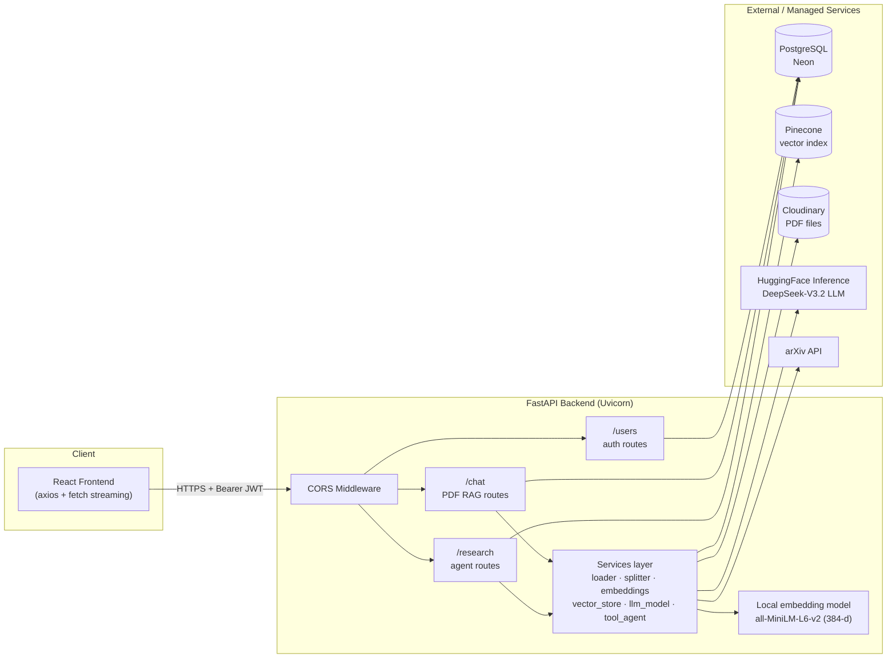

**Where the data lives:**

| Data | Stored in | Why there |
|---|---|---|
| Users, PDF metadata, chat history, research sessions/messages | PostgreSQL | Relational and needs integrity (foreign keys, cascades) |
| Chunk embeddings + chunk text | Pinecone | Needs fast similarity search |
| Original PDF binary | Cloudinary | Blob storage; relational databases handle large files badly |
| LLM & embedding model weights | HF (LLM remote), local cache (embeddings) | |

---

## 5. Code structure: layered architecture

```
backend/src/
├── main.py                  # App factory: creates FastAPI app, CORS, mounts routers, creates tables on startup
├── config/
│   └── db.py                # SQLAlchemy engine, connection pool, Neon retry, SessionLocal, get_db()
├── models/                  # SQLAlchemy ORM models  = DATABASE TABLES
│   ├── user_model.py        #   users
│   ├── pdf_model.py         #   pdfs
│   ├── chat_model.py        #   chats (PDF chat history)
│   ├── research_session.py  #   research_sessions
│   └── research_message.py  #   research_messages
├── schemas/                 # Pydantic models = API REQUEST/RESPONSE SHAPES
│   ├── user_schema.py, pdf_schema.py, chat_schema.py
│   ├── research_chat_schema.py
│   └── arxiv_schema.py      #   SearchInput / PaperMetadata with validators
├── routes/                  # HTTP LAYER: parse request, auth, call services, shape response
│   ├── user_routes.py       #   /users/*  + get_current_user dependency
│   ├── chat_routes.py       #   /chat/*   (PDF upload, RAG chat, history, delete)
│   ├── research_routes.py   #   /research/* (sessions, agent chat)
│   └── research_chat_router.py  # legacy, NOT mounted in main.py
└── services/                # BUSINESS LOGIC, no HTTP knowledge
    ├── loader.py            #   PDF → LangChain Documents (PyMuPDF)
    ├── splitter.py          #   Documents → chunks (RecursiveCharacterTextSplitter)
    ├── embeddings.py        #   text → 384-d vectors (local sentence-transformer, singleton)
    ├── vector_store.py      #   Pinecone upsert / query / delete (cached client)
    ├── llm_model.py         #   RAG prompt building + cached LLM
    ├── tool_agent.py        #   Tool-calling agent (cached LLM + bound tools)
    ├── arxiv_client.py      #   arXiv API wrapper → PaperMetadata
    ├── arxiv_tools.py       #   @tool-decorated function exposed to the LLM
    ├── file_storage.py      #   Cloudinary upload
    ├── research_session.py  #   CRUD for sessions
    └── research_message.py  #   CRUD for messages
```

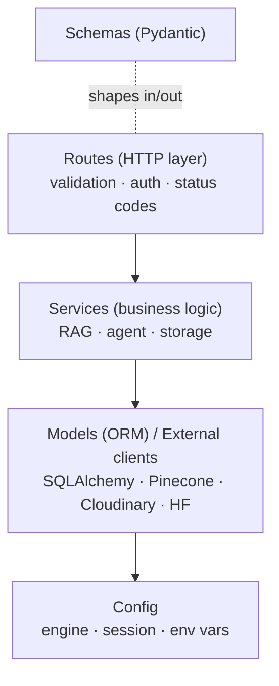

**Interview talking point, *Separation of concerns*:** routes know about HTTP (status codes, `Depends`, `StreamingResponse`); services know nothing about HTTP, so they're reusable and testable. **Models** (SQLAlchemy) describe how data is *stored*; **schemas** (Pydantic) describe how data is *exposed*. Keeping them separate means we never accidentally return `password` to the client: `UserBase` simply doesn't have that field.

---

## 6. Life of a request in FastAPI

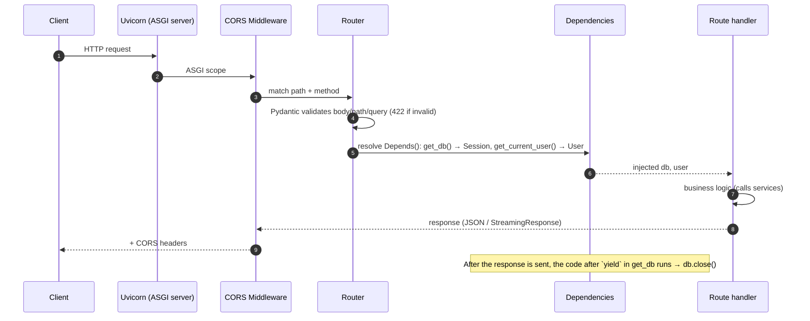

**Key concepts:**

- **ASGI**: the async successor to WSGI. Uvicorn is the ASGI server; FastAPI (built on Starlette) is the app.
- **Dependency Injection (`Depends`)**: `get_current_user` itself depends on `oauth2_scheme` (reads the `Authorization: Bearer` header) and `get_db`. FastAPI resolves this graph for every request, and a dependency used twice is only resolved once per request.
- **Generator dependencies**: `get_db()` uses `yield`. Code before `yield` is setup, code after is teardown (`db.close()`). It works like a context manager.
- **CORS**: browsers block cross-origin requests unless the server sends `Access-Control-Allow-*` headers. We currently allow `*`, which is fine for development and should be tightened for production.
- **Startup hook**: `Base.metadata.create_all()` runs in `@app.on_event("startup")`, not at import time (see §15).

---

## 7. Data model (PostgreSQL)

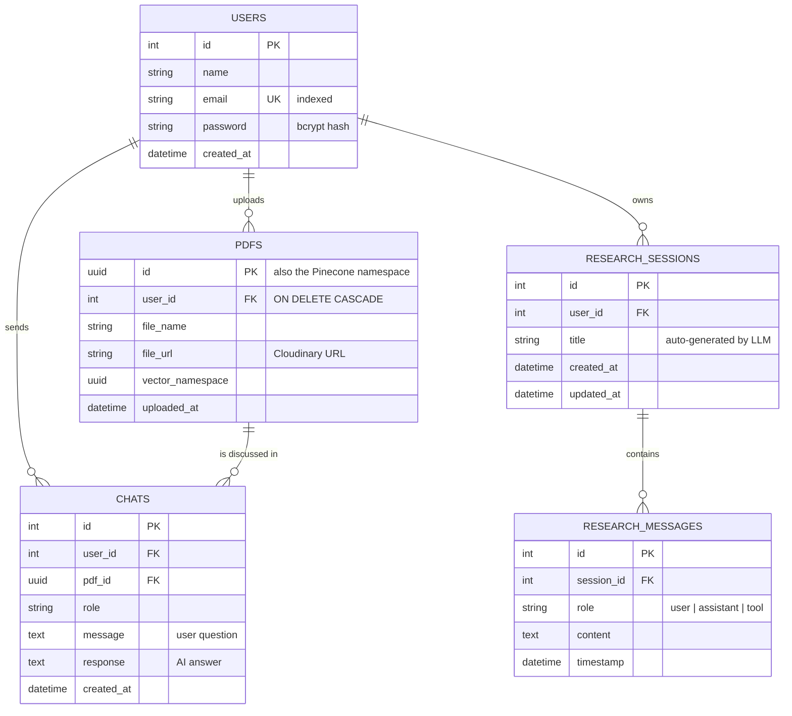

**Design decisions to explain:**

- **PDF id is a UUID, not an auto-increment int.** The same id is used as the **Pinecone namespace**, the temp filename, and the DB primary key. UUIDs can be generated *before* the DB insert (we need the namespace before we write vectors), and they can't be guessed or enumerated from URLs.
- **One `chats` row stores both question and answer** (`message` + `response`). Research messages use **one row per message** with a `role`, because the agent needs a *sequence* of turns, including `tool` outputs.
- **Cascades at two levels**: `ondelete="CASCADE"` on the FK (database-level) and `cascade="all, delete-orphan"` on the relationship (ORM-level). Deleting a user removes their PDFs and chats.
- **Indexes**: `email` is `unique` and `index=True` because every login looks a user up by email.
- **Tables are created with `create_all`**, which only creates missing tables and never alters existing ones. In production you'd use **Alembic migrations**.

---

## 8. Authentication: bcrypt + JWT

### Register & login flow

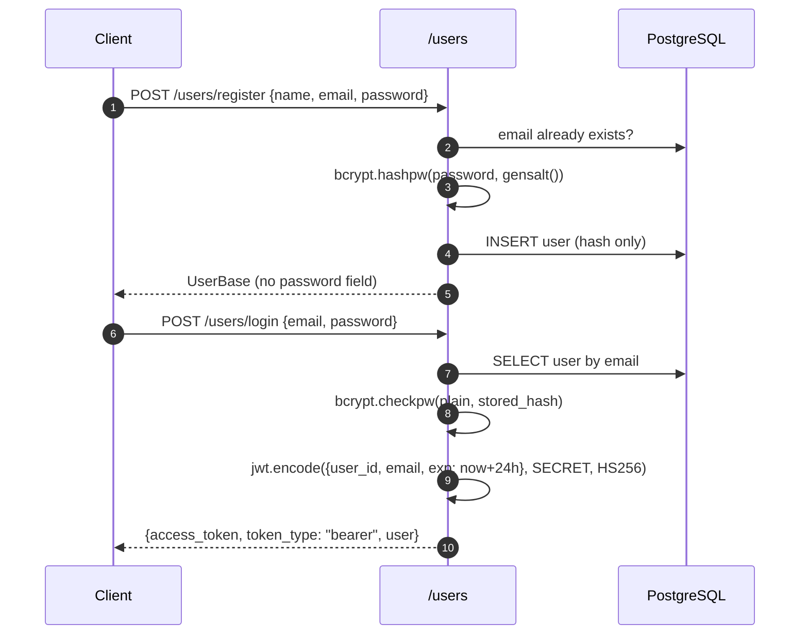

### Authenticated request flow

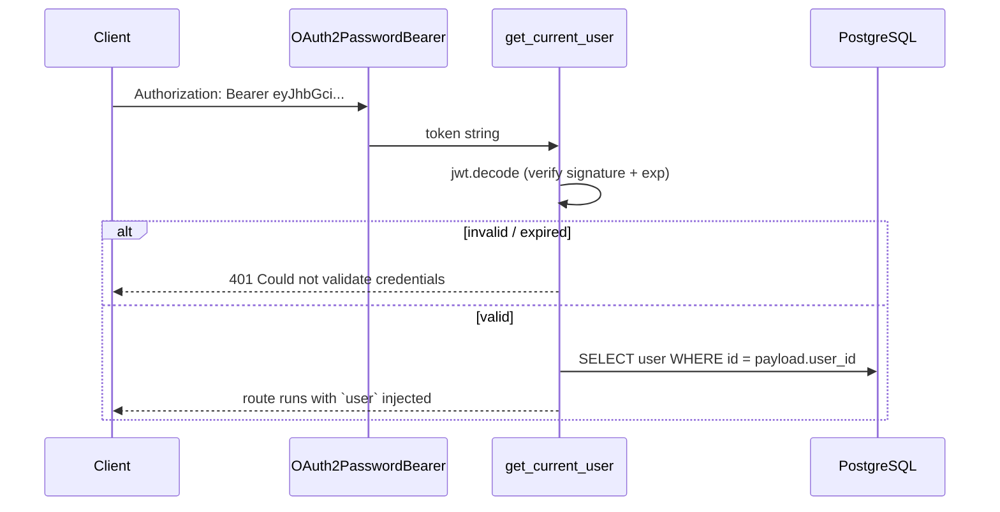

### Concepts you must be able to explain

- **Hashing vs encryption**: hashing is one-way, so we can never recover the password, only compare. Encryption is two-way. Passwords must be **hashed**.
- **Why bcrypt and not SHA-256?** bcrypt is **deliberately slow** (configurable cost factor), which makes brute force expensive. It also embeds a random **salt** in the hash, so two users with the same password get different hashes, which defeats rainbow tables.
- **JWT structure**: `header.payload.signature`, each part base64url-encoded. The payload is **readable by anyone** (it's encoded, not encrypted), so never put secrets in it. The **signature** (HMAC-SHA256 with `JWT_SECRET`) proves the token wasn't tampered with.
- **Stateless auth**: the server stores no sessions. Any server instance holding the secret can verify a token, which makes horizontal scaling easy. The trade-off is that **you can't revoke a token** before it expires (24h here). Fixes: short-lived access tokens plus refresh tokens, or a denylist.
- **Authorization (not just authentication)**: every resource query filters by owner, e.g. `PDF.id == pdf_id AND PDF.user_id == user.id`. Returning **404 instead of 403** for someone else's resource avoids leaking that it exists.
- **Same error for wrong email and wrong password** ("Invalid email or password") prevents **user enumeration**.

---

## 9. Feature 1: PDF ingestion pipeline

`POST /chat/upload` in `routes/chat_routes.py`

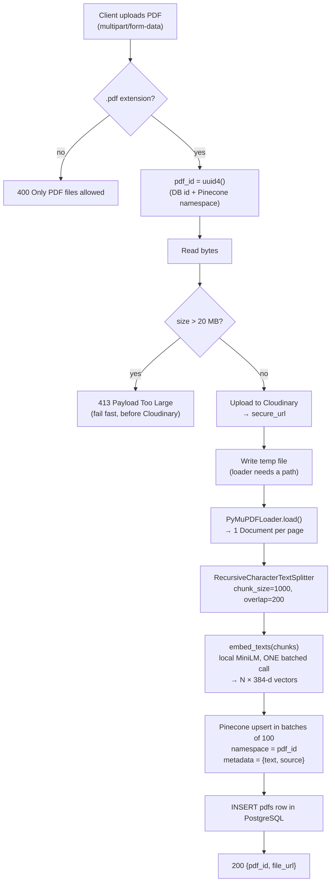

### Concepts

**Why chunk at all?**
1. LLMs have a limited context window, so the whole PDF often won't fit.
2. Retrieval precision: one embedding for a 50-page PDF blurs every topic together. Small chunks each capture one idea.
3. Cost and latency: sending 5 relevant chunks is far cheaper than sending the whole document.

**`RecursiveCharacterTextSplitter`** tries to split on `"\n\n"` (paragraphs), then `"\n"`, then `" "`, then characters. It uses the largest natural boundary that keeps chunks under `chunk_size`, which keeps sentences intact.

**Chunk overlap (200 chars)**: if an important sentence falls on a boundary, the overlap means it still appears whole in at least one chunk. The trade-off is more storage and some duplicate context.

**Embeddings**: a neural network maps text to a fixed-length vector (384 numbers here) so that **semantically similar text lands close together** in vector space. "car" and "automobile" end up near each other even though they share no letters. This is what makes search *semantic* rather than keyword-based.

**Cosine similarity**: `cos(θ) = (A·B) / (|A||B|)` measures the *angle* between vectors and ignores their length. It's the standard metric for sentence embeddings. The Pinecone index is created with `metric="cosine"`, `dimension=384`. **The dimension must match the embedding model**: switching to a 768-d model would require a new index.

**Pinecone namespaces**: one index, and each PDF gets its own **namespace** (= `pdf_id`). Queries are scoped to a single namespace, so:
- one user's chat can never retrieve another user's PDF chunks (data isolation), and
- deleting a PDF is a single call: `index.delete(delete_all=True, namespace=pdf_id)`.

**Batching**: we embed all chunks in **one** model call (the GPU/CPU vectorises the batch) and upsert in batches of **100** (Pinecone limits request size). The original code made **one HTTP call per chunk**, which was slow and failed on large PDFs (see §15).

**Why `def` and not `async def`?** Every step is blocking I/O or CPU work. See §13.

---

## 10. Feature 2: Chat with PDF (RAG)

`POST /chat/{pdf_id}` in `routes/chat_routes.py` + `services/llm_model.py`

### What RAG is

**Retrieval-Augmented Generation**: instead of relying on what the LLM memorised during training, we **retrieve** relevant facts at query time and **put them into the prompt**. The LLM then **generates** an answer grounded in those facts.

Why it matters: the LLM has never seen the user's private PDF, and RAG **reduces hallucination** by telling the model to answer only from the supplied context. It's also far cheaper and faster to update than fine-tuning (just upload a new doc).

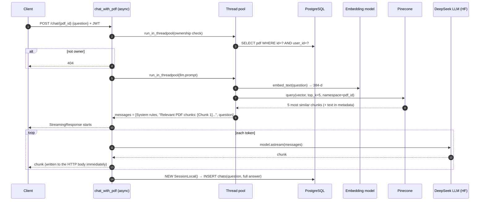

### Prompt structure (`build_rag_prompt`)

```
[System]  You are a research assistant. Answer ONLY using the context provided...
          If the answer is not in chunks, reply "This information is not available..."
          Do NOT use general knowledge. Cite chunk numbers.
[Human]   Relevant PDF chunks:
          [Chunk 1] ...
          [Chunk 5] ...
[Human]   <user's question>
```

- **Grounding instructions** + an explicit **refusal phrase** reduce hallucinations.
- **Citing chunk numbers** makes answers verifiable.
- **top_k = 5**: a trade-off between recall (more chunks = better chance the answer is included) and precision/noise/token cost.
- If retrieval fails, we fall back to a system message asking the user to upload a PDF. The request fails *gracefully* instead of returning a 500.

### RAG failure modes (interviewers love this)

| Failure | Cause | Mitigation |
|---|---|---|
| Right answer not retrieved | Chunk too big/small, question phrased differently | Tune chunk size, hybrid search (BM25 + vectors), query rewriting, reranker |
| Answer retrieved but LLM ignores it | Weak prompt, too much noise | Fewer / reranked chunks, stricter system prompt |
| Hallucination | Model falls back on general knowledge | "Answer only from context" + refusal phrase, lower temperature |
| Lost-in-the-middle | LLMs attend less to the middle of long contexts | Put the best chunks first or last |

---

## 11. Feature 3: Research agent with tool calling

`POST /research/chat` in `routes/research_routes.py` + `services/tool_agent.py`

### What tool (function) calling is

We describe a Python function to the LLM (name, docstring, argument schema). The LLM **doesn't execute anything**. It replies with a structured request, e.g. `{"name": "arxiv_search", "arguments": "{\"query\": \"diffusion models\"}"}`. **Our code** runs the function and feeds the result back. This lets the LLM access live data (arXiv) it wasn't trained on.

```python
@tool                                   # LangChain turns signature + docstring into a JSON schema
def arxiv_search(query: str, max_results: int = 10, ...) -> List[PaperMetadata]:
    """Search research papers from arXiv using a query string"""
    ...
agent = chat_model.bind_tools(tools=[arxiv_search])   # sends the schema with every request
```

### Two-pass flow

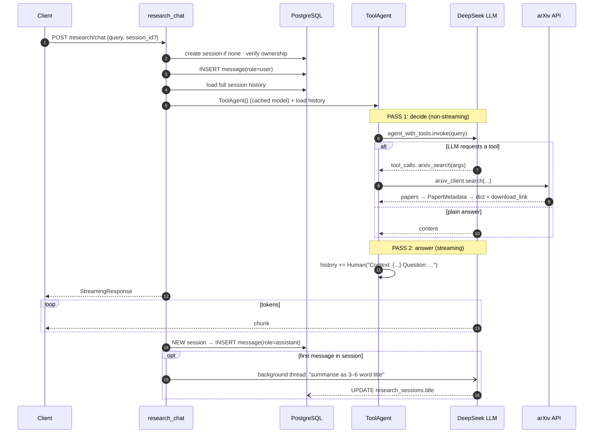

### Concepts & design decisions

- **Why two passes?** Pass 1 needs the *complete* structured response to know whether a tool was requested. Pass 2 streams a nicely written answer that uses the tool results as context.
- **Chat memory**: stored in PostgreSQL (`research_messages`), reloaded on each request, and converted to LangChain messages (`HumanMessage`, `AIMessage`, and `SystemMessage` for tool output). The server stays **stateless**, so any instance can serve any session.
- **`role="tool"` messages are hidden from the UI**: `GET /sessions/{id}/messages` filters to `user`/`assistant`, because raw JSON tool output was rendering as garbage in the chat window.
- **Auto-title in a background thread** (`threading.Thread(daemon=True)`): it runs *after* the stream finishes, so it adds **zero latency** for the user. It reuses the already-loaded model and opens its own DB session, because it outlives the request.
- **Pydantic validation of external data**: arXiv results are parsed into `PaperMetadata`, so malformed results are skipped rather than crashing the request.
- **`ChatPromptTemplate` + `MessagesPlaceholder`**: a fixed system prompt followed by a slot for the dynamic message history.

**Agent vs chain (common question):** a *chain* is a fixed sequence of steps. An *agent* lets the LLM *decide* which step or tool to use. Ours is a **single-step agent**: one round of tool calls, then the answer. A full agent loop (ReAct, or LangGraph's `create_react_agent`) repeats *think → call tool → observe* until the model says it's done.

---

## 12. Streaming responses

**Why stream?** An LLM may take 10–20 s to generate a full answer, but the first token arrives in about 1 s. Streaming dramatically improves **perceived latency (time-to-first-token)**. It's the ChatGPT typing effect.

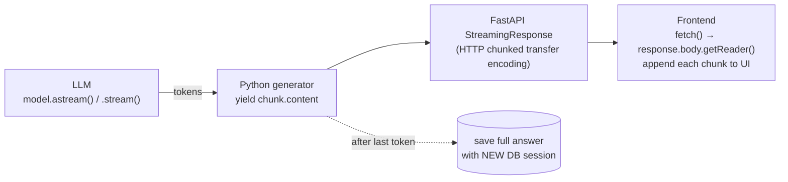

**Important details:**

1. **Chunked transfer encoding**: the HTTP response is sent in pieces without a known `Content-Length`. We set `media_type="text/event-stream"`, but we send **raw text chunks, not formal SSE** (`data: ...\n\n` framing). That's why the frontend uses `fetch` + `getReader()` and not `EventSource`. (`EventSource` also can't send POST bodies or `Authorization` headers.)
2. **The DB-session bug we fixed**: FastAPI runs the teardown of `Depends(get_db)` (i.e. `db.close()`) as soon as the handler **returns** the `StreamingResponse` object, which is *before* the generator body runs. Saving the answer with the request's `db` failed silently, and chat history never saved. **Fix:** open a fresh `SessionLocal()` inside the generator and close it in `finally`.
3. **Async vs sync generators**: the PDF route uses `async for chunk in model.astream()` (non-blocking). The research route uses a sync generator with `model.stream()`, and Starlette automatically iterates sync generators in a thread pool so the event loop isn't blocked.

---

## 13. Concurrency: async vs sync, the event loop, thread pools

This is the most important "senior-sounding" topic in this project.

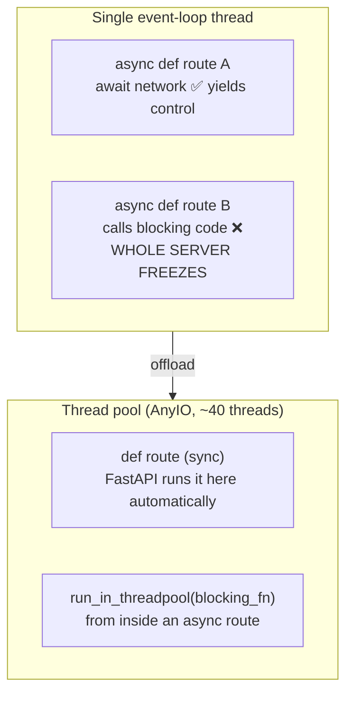

**The rule:**

| You write | FastAPI does | Use it when |
|---|---|---|
| `async def` | Runs directly **on the event loop** | Everything inside is `await`-able (async HTTP client, `astream`) |
| `def` | Runs in a **worker thread** | The handler calls blocking libraries (SQLAlchemy sync, Pinecone SDK, PyMuPDF, Cloudinary) |
| `async def` + `await run_in_threadpool(fn)` | Mix: blocking parts in a thread, async parts on the loop | You need async streaming *and* blocking setup (our PDF chat route) |

**The bug we fixed:** `upload_pdf` was `async def`, but everything it called was blocking (Cloudinary, parsing, embedding, Pinecone, DB). While one user uploaded a PDF, **every other request on the server froze**. Changing it to plain `def` moved it to a worker thread. In `chat_with_pdf` we kept `async def` (for `astream`) but wrapped the DB query and retrieval in `run_in_threadpool`.

**Why is the embedding model safe to share across threads?** It's loaded once (singleton) and inference is read-only. PyTorch releases the GIL during heavy tensor operations.

**GIL, in one line:** Python threads can't run Python bytecode in parallel, but they **do** run in parallel while waiting on I/O or inside C extensions that release the GIL, which covers almost everything we do here.

---

## 14. Database layer: SQLAlchemy, pooling, Neon cold starts

`config/db.py`

```python
engine = create_engine(DATABASE_URL,
    pool_pre_ping=True,   # test a pooled connection with a light ping before use; replace if dead
    pool_recycle=180,     # proactively replace connections older than 3 min
    pool_size=5, max_overflow=5,   # 5 persistent + up to 5 burst connections
    connect_args={"connect_timeout": 10, "keepalives": 1, ...})  # TCP keepalives
```

**Connection pooling**: opening a Postgres connection (TCP + TLS + auth) costs tens to hundreds of milliseconds. A pool keeps connections open and lends them to requests. `get_db()` borrows one per request, and `db.close()` **returns it to the pool** (it doesn't close the socket).

**Neon cold-start problem & fix:**

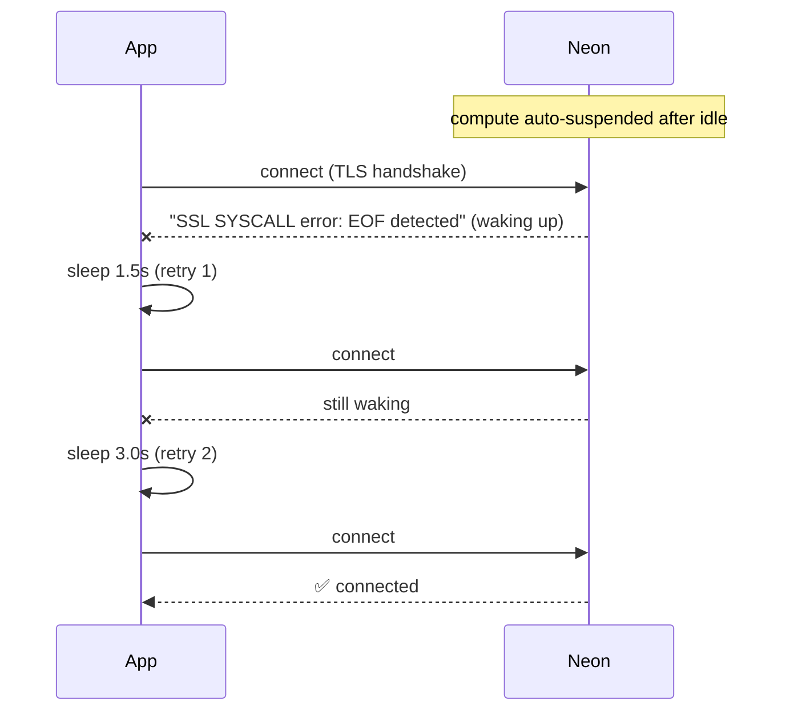

- `pool_pre_ping` only validates **existing** pooled connections. It can't help with a **brand-new** connection failing.
- So we hook SQLAlchemy's `do_connect` event and **retry the raw connect up to 3 times with linear backoff** (1.5 s, 3 s). Users see a short delay instead of a 500.
- `pool_recycle=180` + keepalives: Neon and proxies silently drop idle connections, so we recycle them before that happens.

**Session settings**: `autocommit=False` (explicit `db.commit()`, so a transaction either fully succeeds or rolls back), `autoflush=False` (no surprise SQL before queries).

**`db.refresh(obj)`** after commit reloads server-generated values (`id`, `created_at` from `server_default=func.now()`).

---

## 15. Performance & reliability fixes we made (your "war stories")

Tell these using **STAR**: *Situation → Task → Action → Result*. Each one demonstrates a transferable engineering skill.

| # | Problem (symptom) | Root cause | Fix | Concept it demonstrates |
|---|---|---|---|---|
| 1 | **Server took ~2.5 min to start** | Top-level imports of `langchain_huggingface`, `langchain_community.document_loaders` and `langchain_text_splitters` transitively imported `transformers` + `torch` (~60–120 s) | Measured with `python -X importtime`, then moved heavy imports **inside the functions that use them** (lazy imports). DB `create_all` moved to a startup hook | Profiling before optimising; lazy loading. **Result: ~151 s → ~40 s** |
| 2 | Whole server froze during PDF uploads | Blocking code inside `async def` blocked the event loop | Changed to `def` (thread pool); `run_in_threadpool` in the async chat route | Event loop vs thread pool (§13) |
| 3 | Chat history / assistant replies silently never saved | Request-scoped DB session closed **before** the streaming generator ran | Fresh `SessionLocal()` inside the generator | Dependency lifecycle vs streaming lifecycle (§12) |
| 4 | Large PDFs failed with intermittent **502 Bad Gateway** | One remote HF Inference API call **per chunk** against a shared, rate-limited endpoint | Run the embedding model **locally**, one **batched** call; Pinecone upsert in batches of 100 | Removing network round-trips; batching |
| 5 | Every chat message was slow to start | LLM client (+ tool binding) rebuilt on **every request**; Pinecone `list_indexes()` called on **every** search | Module-level **singletons / caches**: `_get_model()`, `_get_chat_model()`, `_get_pinecone_client()`, `_verified_indexes` | Caching expensive stateless objects |
| 6 | First request after idle → **500 SSL EOF** | Neon serverless compute cold start | Retry `do_connect` with backoff + pool recycle/keepalives | Resilience against transient failures (§14) |
| 7 | Uploads of huge PDFs → 500 after a long wait | Cloudinary rejected the file only *after* the full upload | Check size ourselves first → **413** with a clear message | Fail fast; correct HTTP status codes |
| 8 | Reloaded research chats showed JSON blobs | `role="tool"` rows returned to the UI | Filter to `user`/`assistant` in the list endpoint | Separate internal state from presentation |
| 9 | Session titles were just the raw first message | No summarisation | LLM-generated 3–6 word title in a **background thread** after the stream finishes | Moving non-critical work off the hot path |

> **How to tell story #1 in an interview:**
> "Our dev server took about two and a half minutes to boot. Instead of guessing, I ran `python -X importtime` and sorted by cumulative time. It showed `langchain_text_splitters` was pulling in `transformers` and `sentence_transformers`, and `langchain_huggingface` was pulling in `torch`. That was over two minutes of import time, even though most requests never use those modules. I moved those imports inside the functions that need them, so the cost is paid once, on first use. Startup went from ~151 s to ~40 s. The remaining time comes from `langchain_core` itself importing `transformers` whenever it's installed, and I'd only remove that by moving embeddings to a hosted API."

---

## 16. Known limitations & what I'd improve

Raising these yourself shows maturity. Each one is real in the current code.

**Correctness / security**
1. **Cloudinary `public_id` uses only the filename with `overwrite=True`.** Two users uploading `paper.pdf` overwrite each other's file. *Fix:* use `public_id=f".../{pdf_id}"`.
2. **Tool results aren't persisted.** `get_research_context` returns the key `"tool_results"`, but the route checks `"tool_result"` (singular), so `role="tool"` rows never get saved. *Fix:* use one consistent key.
3. **PDF chat has no multi-turn memory in the prompt.** History is saved to the `chats` table, but `LLMModel` is recreated per request with an empty `ChatMessageHistory`. *Fix:* load the last N exchanges from the DB into the prompt.
4. **JWT secret has a hard-coded fallback** (`"supersecretkey"`). The app should refuse to start if `JWT_SECRET` is missing. Also, `exp` is built with naive `datetime.now()`; use `datetime.now(timezone.utc)`.
5. **CORS `allow_origins=["*"]`**: restrict to the frontend domain in production.
6. **No refresh tokens / revocation**, and no rate limiting on `/login` (brute-force risk).

**Data consistency**
7. **Upload isn't transactional across systems.** If Pinecone or the DB fails after the Cloudinary upload, we leave orphaned files or vectors. *Fix:* clean up in `except` (compensating actions, the Saga pattern), or run a background reconciliation job.
8. **Delete doesn't remove the Cloudinary file.** The temp file in `upload_pdf` is never deleted either.

**Scalability / architecture**
9. **Ingestion is synchronous.** A 200-page PDF holds the HTTP request open. *Fix:* return `202 Accepted` + a job id, process in a **task queue** (Celery/RQ/ARQ), and let the client poll a status endpoint.
10. **Embedding model runs in the API process**: it uses RAM per worker and needs `torch` (slow startup). *Fix:* a separate embedding service or a hosted embeddings API.
11. **Only a single tool-call round**: use a LangGraph ReAct loop for multi-step research.
12. **`create_all` instead of migrations**: adopt **Alembic**. Also `@app.on_event` is deprecated; use the `lifespan` context manager.
13. **Observability**: replace `print` with structured `logging`, and add request IDs, LangSmith tracing, and metrics.
14. **Tests**: add unit tests for services (mock Pinecone/HF) and API tests with `TestClient` + dependency overrides.
15. **Retrieval quality**: add a reranker, hybrid search, and metadata such as page numbers for citations.
16. `routes/research_chat_router.py` is dead code (not mounted). Remove it.

---

## 17. API reference

All routes except register/login require `Authorization: Bearer <token>`.

| Method | Path | Handler | Description |
|---|---|---|---|
| GET | `/` | `root` | Health check |
| POST | `/users/register` | `register_user` | Create account (bcrypt hash) |
| POST | `/users/login` | `login_user` | Returns JWT + user |
| GET | `/users/me` | `get_me` | Current user |
| POST | `/chat/upload` | `upload_pdf` | Upload + index a PDF (multipart, ≤ 20 MB) |
| GET | `/chat` | `list_user_pdfs` | User's PDFs, newest first |
| POST | `/chat/{pdf_id}` | `chat_with_pdf` | **Streaming** RAG answer |
| GET | `/chat/{pdf_id}/history` | `get_chat_history` | Past Q&A for a PDF |
| DELETE | `/chat/{pdf_id}` | `delete_pdf` | Delete metadata + Pinecone namespace |
| POST | `/research/sessions` | `create_research_session` | New session |
| GET | `/research/sessions` | `list_user_sessions` | User's sessions |
| GET | `/research/sessions/{id}/messages` | `list_messages` | Visible messages (user/assistant) |
| DELETE | `/research/sessions/{id}` | `delete_session` | Delete session + messages (204) |
| POST | `/research/chat` | `research_chat` | **Streaming** agent answer (creates a session if none) |

**Environment variables:** `DATABASE_URL`, `JWT_SECRET`, `HUGGINGFACE_API_KEY`, `PINECONE_API_KEY`, `PINECONE_INDEX_NAME`, `CLOUDINARY_CLOUD_NAME`, `CLOUDINARY_API_KEY`, `CLOUDINARY_API_SECRET`.

**Run:** `uvicorn src.main:app --reload --port 8000` from `backend/` → interactive docs at `http://localhost:8000/docs`.

---

## 18. Interview question bank (with answers)

Practise answering these **out loud** in 30–60 seconds each.

### Project & architecture

**Q: Walk me through the architecture.**
Draw §4. FastAPI with three routers (auth, PDF RAG, research agent) and a services layer. Postgres holds relational data, Pinecone holds vectors, Cloudinary holds files, HuggingFace hosts the LLM, and arXiv provides live paper data. Then walk through one request end to end.

**Q: What happens when a user asks a question about their PDF?** Walk through §10: auth → ownership check → embed question → Pinecone top-5 in that PDF's namespace → build grounded prompt → stream tokens → save Q&A.

**Q: Why store data in three different places?** Each store is suited to one access pattern: relational integrity (Postgres), nearest-neighbour search (Pinecone), and large binary blobs (Cloudinary).

**Q: How would you scale this to 10,000 users?** Run multiple stateless API instances behind a load balancer (JWT makes this easy). Move ingestion to a task queue with workers. Move embeddings to a dedicated service. Tune DB connection pools per instance or use PgBouncer. Pinecone serverless scales on its own. Add rate limiting and caching of frequent queries.

### RAG & LLM

**Q: What is RAG and why not fine-tune?** Retrieve relevant context and generate an answer from it. Fine-tuning teaches *style or behaviour*, is expensive, and needs retraining for every new document. RAG adds *knowledge* instantly, per user, with citations.

**Q: What is an embedding? Why 384 dimensions?** A dense vector representing meaning. 384 is the output size of all-MiniLM-L6-v2, which trades a bit of accuracy for speed and size compared with 768/1024-d models. The Pinecone index dimension must match it.

**Q: Why cosine similarity?** It compares direction (meaning) and ignores magnitude. For normalised vectors it's equivalent to dot product.

**Q: How does Pinecone find neighbours fast?** Approximate Nearest Neighbour (ANN) indexes such as HNSW graphs or IVF clusters. They trade a tiny bit of accuracy for sub-linear search time instead of comparing against every vector.

**Q: How did you choose chunk size 1000 / overlap 200?** They're common defaults: big enough to hold a full idea, small enough to be specific. The overlap protects sentences that fall on boundaries. I'd tune them with an evaluation set (retrieval hit rate).

**Q: How do you reduce hallucinations?** Grounding instructions, an explicit "not available" answer, chunk citations, only relevant chunks, and a lower temperature.

**Q: How would you evaluate RAG quality?** Build a set of question/answer/source triples. Measure retrieval (hit rate, MRR: did the right chunk come back?) and generation (faithfulness, answer relevance, e.g. with RAGAS or LLM-as-judge).

**Q: Explain tool calling.** The LLM receives JSON schemas of the functions it can use. It returns a structured call. Our code executes it and passes the result back as context. The LLM never runs code itself.

**Q: What's temperature / top_p?** Temperature scales the randomness of token sampling (0 is nearly deterministic). top_p (nucleus sampling) samples only from the smallest set of tokens whose probability sums to p. We use 0.7 / 0.9.

### Backend / FastAPI / Python

**Q: `async def` vs `def` in FastAPI?** See §13. Blocking code inside `async def` freezes the event loop, and this caused a real bug for us.

**Q: How does `Depends` work?** FastAPI resolves a dependency graph per request, caches each dependency within the request, and runs teardown code after `yield`.

**Q: Why did saving chat history fail with streaming?** Dependency teardown runs when the handler returns the `StreamingResponse`, before the generator executes. Fix: a new session inside the generator.

**Q: Pydantic model vs SQLAlchemy model?** SQLAlchemy models map to tables (persistence). Pydantic models validate and serialise API I/O. `from_attributes=True` lets Pydantic read ORM objects.

**Q: What status codes do you use and why?** 400 (bad input, e.g. not a PDF), 401 (bad or missing token), 403 (wrong user_id in body), 404 (not found *or not yours*), 413 (file too large), 422 (Pydantic validation, automatic), 500 (unexpected), 204 (delete with no body).

**Q: What is connection pooling and what does `pool_pre_ping` do?** See §14.

**Q: How did you debug slow startup?** `python -X importtime`, sort by cumulative time, then lazy imports. ~151 s → ~40 s.

### Security

**Q: How are passwords stored?** bcrypt with a per-password salt. Never plaintext, never reversible.

**Q: Is JWT secure if anyone can decode it?** Yes, for integrity. The signature prevents tampering, but the payload isn't secret, so we only store `user_id` and `email`. Always use HTTPS, keep expiry short, and keep the secret safe.

**Q: How do you stop user A from reading user B's PDF?** Every query filters by `user_id` from the verified token, and Pinecone queries are scoped to a namespace that's only reachable after that ownership check.

**Q: What security issues exist today?** Mention items 1, 4, 5 and 6 from §16. Interviewers reward honesty.

---

## 19. Glossary / cheat sheet

| Term | One-line meaning |
|---|---|
| **ASGI** | Async server interface between Uvicorn and FastAPI |
| **Event loop** | Single thread that switches between tasks whenever one `await`s |
| **Thread pool** | Worker threads where FastAPI runs sync `def` routes |
| **Dependency Injection** | Framework builds and passes in what a function needs (`db`, `user`) |
| **ORM** | Map Python classes to DB tables (SQLAlchemy) |
| **Connection pool** | Reuse open DB connections instead of reconnecting |
| **Cold start** | Serverless resource waking up after idle; first call is slow or fails |
| **Exponential/linear backoff** | Wait progressively longer between retries |
| **bcrypt / salt** | Slow password hash / random value making identical passwords hash differently |
| **JWT** | Signed, self-contained token: `header.payload.signature` |
| **Stateless auth** | Server keeps no session; token carries identity |
| **Embedding** | Vector representation of meaning |
| **Cosine similarity** | Angle-based similarity between vectors |
| **Vector DB / ANN** | Database optimised for nearest-neighbour search (approximate, fast) |
| **Namespace (Pinecone)** | Partition inside an index; we use one per PDF |
| **Chunking / overlap** | Splitting docs into pieces / repeating text across boundaries |
| **RAG** | Retrieve relevant context → put in prompt → generate grounded answer |
| **Hallucination** | LLM confidently producing unsupported content |
| **Tool / function calling** | LLM outputs a structured request for our code to execute |
| **Agent** | LLM that decides which actions/tools to take |
| **Streaming / TTFT** | Sending tokens as generated / time-to-first-token |
| **Chunked transfer encoding** | HTTP body sent in pieces without known length |
| **SSE** | Server-Sent Events: `data:`-framed one-way stream (we send raw chunks instead) |
| **Lazy import** | Import inside a function so the cost is paid on first use, not at startup |
| **Singleton / module cache** | Build an expensive object once per process and reuse it |
| **Idempotent** | Repeating the call has the same effect (DELETE, PUT) |
| **Saga / compensating action** | Undo earlier steps when a multi-system operation fails midway |

---

*Good luck. If you can draw §4, narrate §9–§11, and tell two stories from §15 confidently, you've covered 90% of what an interviewer will ask about this project.*
